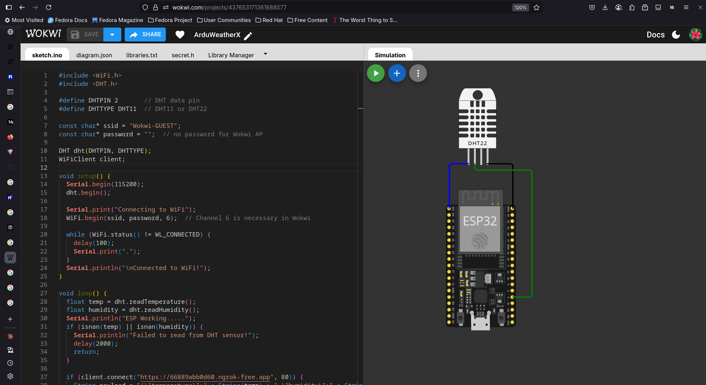

# ArduWeatherX 

# Architecture 

```pgsql
            +-------------------------+
            |  1. Sensor Simulation   |
            |  (Wokwi / Python)       |
            +-----------+-------------+
                        |
                        |  JSON Payload (Temp, Humidity)
                        v
           +------------+-------------+
           | 2. Cloud Data Ingest API |
           |  (Flask or Node.js)      |
           +------------+-------------+
                        |
                        | Writes data
                        v
         +--------------+---------------+
         |   3. Cloud Database (DB)     |
         | Firebase / AWS DynamoDB etc.|
         +--------------+---------------+
                        |
                        |  Fetch via API
                        v
       +----------------+-----------------+
       | 4. Web Dashboard (React / HTML)  |
       | Real-time data display, charts  |
       +----------------------------------+


```
# ESP32 Module Connection Design



