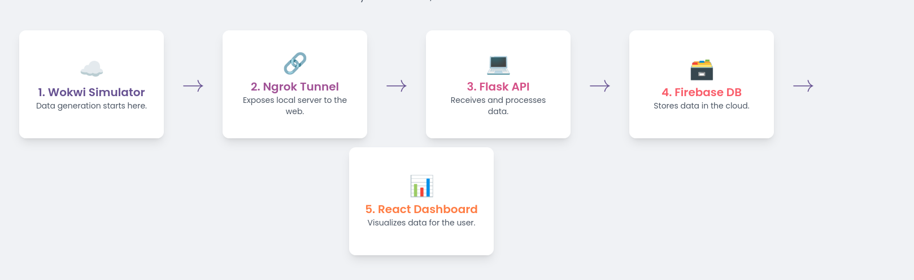
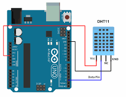
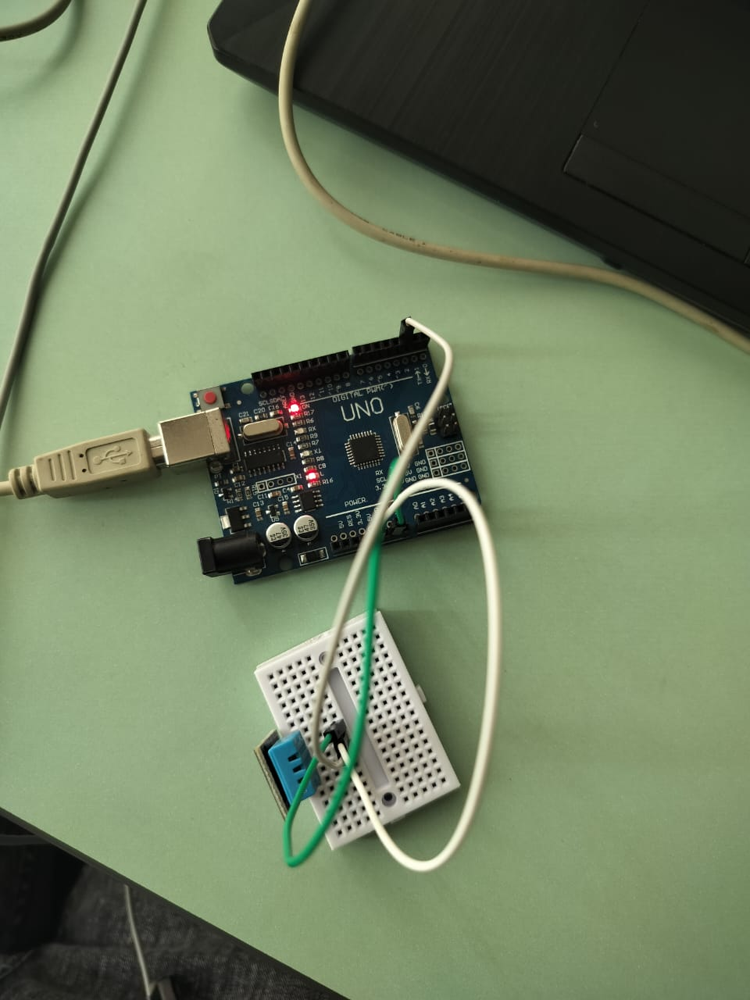
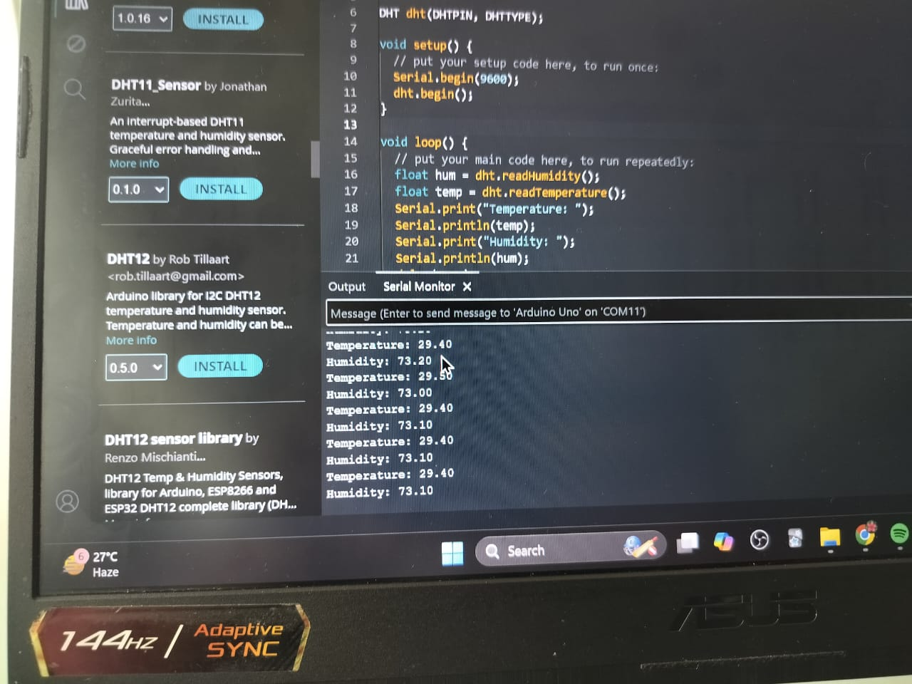

# ArduWeatherX

## Overview

ArduWeatherX is a comprehensive, scalable, and cost-effective IoT weather monitoring solution. It integrates a real Arduino sensor, cloud-native backend, real-time database, and interactive web dashboard to deliver up-to-the-second weather data. Designed as a robust template, it is suitable for smart agriculture, home automation, environmental studies, and other real-world applications requiring reliable weather insights.

## Table of Contents

- [Features](#core-features)
- [Architecture](#architecture)
- [Dashboard Preview](#dashboard-preview)
- [Arduino Connection Design](#arduino-connection-design)
- [Output](#output)
- [Technology Stack](#technology-stack)
- [Getting Started](#getting-started)
- [Project Structure](#project-structure)
- [Contributing](#contributing)
- [License](#license)

## Core Features

- **Real-time Sensor Simulation:**  
       Utilizes the Arduino circuit to simulate a DHT11 temperature and humidity sensor, providing a continuous, realistic stream of data for development and testing without requiring physical hardware. The simulation includes a 5% chance of generating invalid readings to allow for robust error-handling development.

- **Scalable Serverless Backend:**  
       Transitions seamlessly from a local Flask server for rapid development to a highly scalable, event-driven AWS Lambda backend for production. This serverless architecture ensures high availability and cost efficiency through a pay-per-use model.

- **Persistent Cloud Storage:**  
       Leverages Firebase Realtime Database for low-latency, persistent storage of all incoming sensor data. The data is structured and indexed by timestamp for efficient querying and real-time synchronization with the frontend.

- **Interactive Web Dashboard:**  
       A modern, responsive frontend built with React and Vite, providing a real-time visualization of temperature and humidity data. The dashboard updates automatically as new data arrives in Firebase, without requiring page reloads.

- **Secure & Efficient Delivery:**  
       In the production environment, the frontend is deployed to Amazon S3 and served globally via the AWS CloudFront Content Delivery Network (CDN). This ensures low latency for users worldwide and a secure connection via HTTPS.

- **Automated CI/CD Pipeline:**  
       Features a complete Continuous Integration and Continuous Deployment (CI/CD) pipeline using AWS CodePipeline. This pipeline automates the build, test, and deployment process for both the backend Lambda function and the frontend React application, ensuring rapid and reliable updates.

## Architecture 

The system architecture consists of the following components:

- **IoT Device Simulation:** Wokwi simulates the DHT11 sensor, sending data to the backend.
- **Backend:** Flask (local) or AWS Lambda (production) receives, validates, and processes sensor data.
- **Database:** Firebase Realtime Database stores sensor readings, indexed by timestamp.
- **Frontend:** React dashboard visualizes real-time data and provides user interaction.
- **Cloud Infrastructure:** AWS S3, CloudFront, API Gateway, and CodePipeline manage hosting, delivery, and CI/CD.



## Dashboard Preview

*Coming soon: Screenshots and GIFs of the live dashboard.*

## Arduino Connection Design

Below are the connection diagrams for the simulated Arduino setup:




## Output 

Example output from the simulated DHT11 sensor:



## Technology Stack

The project utilizes a modern, robust technology stack chosen to support real-time data processing, scalability, and a rich user experience.

| Category        | Technology                                              | Purpose                                                                                   |
|-----------------|--------------------------------------------------------|-------------------------------------------------------------------------------------------|
| Frontend        | React, Vite, TailwindCSS                               | Building a dynamic, responsive, and real-time user interface.                             |
| Backend         | Python, Flask, AWS Lambda                              | Data ingestion, validation, and processing. Flask for local dev, Lambda for production.   |
| Database        | Firebase Realtime DB                                   | NoSQL, real-time, persistent cloud storage for sensor data.                               |
| IoT Simulation  | Wokwi (Arduino C++)                                    | Simulating a DHT11 sensor to generate temperature/humidity data.                          |
| Cloud & DevOps  | AWS (S3, CloudFront, API Gateway, Lambda, CodePipeline)| Hosting, deployment, CI/CD, and serverless infrastructure.                                |
| Tooling         | Node.js, ESLint, Git, Terraform                        | Frontend runtime, code linting, version control, Infrastructure as Code.                  |

## Getting Started

### Prerequisites

- Node.js (v18+)
- Python (v3.8+)
- AWS account (for cloud deployment)
- Firebase account (for database)
- Git

### Local Development

1. **Clone the repository:**
        ```bash
        git clone https://github.com/yourusername/ArduWeatherX.git
        cd ArduWeatherX
        ```

2. **Install frontend dependencies:**
        ```bash
        cd frontend
        npm install
        npm run dev
        ```

3. **Run backend locally:**
        ```bash
        cd backend
        pip install -r requirements.txt
        python app.py
        ```

4. **Simulate IoT sensor:**
        - Open the Wokwi project and start the simulation.
        - Configure the backend endpoint in the simulation code.
## Project Structure

```
ArduWeatherX/
├── backend-weather/  # Flask app and ngrok tunnel for local development
├── frontend/         # React dashboard
├── images/           # Architecture and circuit diagrams
├── docs/             # Additional documentation
├── sketch_jul31a.ino # Arduino sketch for DHT11 simulation
└── README.md
```

## Contributing

Contributions are welcome! Please open issues or submit pull requests for improvements, bug fixes, or new features. See [CONTRIBUTING.md](./docs/CONTRIBUTING.md) for guidelines.

## License

This project is licensed under the MIT License. See [LICENSE](./LICENSE) for details.

---

For questions or support, contact [maintainer@example.com](mailto:maintainer@example.com).
